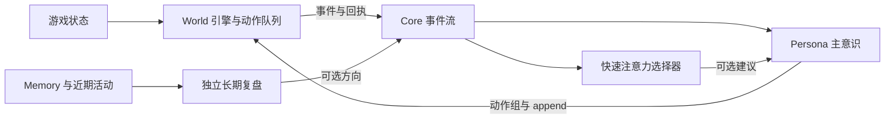

Owner: `attention-adviser.ts`, `reference-library.ts`, `reference-adviser.ts`, `reference-routing.ts`, `planning-review.ts`, `failure-reflection.ts`, `action-evidence.ts` and `persona.ts`.

# CortiV 的即时观察与长期复盘

Minecraft World 提供附近玩家、可见性、姿态与队列回执等事实；Core 负责投递和独立 session 生命周期；CortiV Persona 解释互动、形成计划；长期偏好与经历放在 Memory。千灯纪的技能和规则由独立 World 扩展提供。

Minecraft 的协议连接、寻路和身体队列在引擎子进程运行，模型请求在主进程异步等待。跨进程通过带请求编号的 IPC、事件和回执同步，不直接共享可写内存。身体动作由一个执行器串行调度，后台复盘不能直接指挥身体。

| 通道 | 如何运行 | 输出 |
| --- | --- | --- |
| World 快速观察与执行 | 几何和姿态边沿检测、原版状态、后台串行动作队列，不调用模型 | 可验证事件、动作及终态 |
| 快速注意力 | 可选的选择器，只传一个近期短场景和一道选择题 | 标为推测的注意力建议，加入当前批 |
| 资料快判断 | 后台选择器读取短场景和主题卡，每次一道主题选择题 | 有置信度的阅读建议，最多展开少量候选，不执行动作 |
| 主意识 | 现役模型接收事件、使用 World 工具 | 自选对话、动作、短计划和待办 |
| 长期复盘 | 独立 provider 的只读后台 session，默认每30分钟 | 有依据的可选方向，主意识决定是否采纳 |

`fastAttention` 默认关闭，端点为空。服务须接受 `{state: object, questions: object}`，返回 `answers.attention` 的 choice、confidence 与 probabilities。默认请求上限180ms、置信度0.75、每玩家15秒冷却，仅处理30秒内且可见、8格内的结构化观察。超时、低置信度、过期或无服务时保留原事件；不取消危险反射、聊天或任务。分类器不能发台词或调用工具。分类请求会短暂等待在投递边界，不能取消已经在途的主模型输出。

`planning` 默认关闭。部署可将 `enabled` 设为true、`provider` 指向已注册的provider；模型、推理强度与端点在provider库配置，不修改主会话。`maxContextTokens` 是输入材料的估算上限，应适合该provider窗口；`maxOutputTokens` 与 `timeoutMs` 只限制此复盘。`memoryFiles` 每行一个工作区相对路径。

复盘读取人格、指定Memory文件、启用的参考主题目录、待办和近期调用/回执，区分意图与实际结果。只允许一个在途请求，工具表为空，不继承主会话完整前缀，不直接操作World或改写Memory。停止运行时取消请求；迟到结果不投递。控制台 `planning/state` 查询状态，`planning/review` 手动请求一次，定时节奏不变。换成网络大模型时只需新建provider并修改 `planning.provider`。

记忆整理在交接历史之外读取 World 的 `requestFacts` 现场缓存与 `verifiedFacts` 已核实结果。读取不触发工具或改变现场采样时刻；单个现场缓存限2400字符、单个结果限500字符，合并限4800字符并计入后台上下文预算。一种来源读取失败时仍保留另一种来源。

活动日程启用时，规划材料提供当前阶段摘要和阶段证据；规划时的背景说明只在账本中保留。
前台最新状态已提供时，短请求省略同类型的历史 Persona 检查点，完整原文仍由上下文账本保存。

`references` 默认关闭。`indexFiles` 每行配置一个工作区索引，支持现有 `categories` 列表及其 `activities` 文件。`reference_guide` 从主题目录逐步读取候选与单项详细内容；当前分支替换旧分支，按 `maxContextTokens` 估算预算，超过预算的原文仍可按返回路径读回。目录及分类的真实路径必须在显式索引目录内。原版、服务器和其他环境资料各自通过索引配置，读取机制不内置服务器技能或游戏目标。读取只是资料访问，不自动写入亲历记忆。

`fastReference` 默认关闭，服务接口与快速注意力相同。每次只问一个主题 choice，含无需新资料的选项；场景与主题数分别限制为2400字符和16项，较大目录仍可人工分页选择。主题达到配置置信度才自动打开少量候选；单项细节与复杂计划由主意识选择。已有详细分支、过期、重载、低置信度和服务失败均保留当前计划。请求在后台运行，不延长本次事件投递；通过验证的结果才唤醒下一次投递。近期真实意图及直接回执、少量事件和当前资料分支进入短请求；无近期意图时附少量World事实。分类结果、输入游标、置信度和延迟写入运行日志，不写成已观察事实或动作指令。

资料快判断优先读取本批非快照事件；较长事件保留开头的目标与末尾的结果，中间明确标记未展开。调用受理与异步执行终态分开提供。手动查看目录或读取失败不锁定主题；选定 guides/detail 后才保留手动分支，直到关闭或重新选择。

`planning.maxResultAgeMs` 默认5分钟，从本次材料采样开始计时，按请求开始时的配置固定。过期结果不投递，活动仍可供后续复盘；普通前台新行动不会直接作废未过期建议，主意识根据较新的实际回执决定是否采纳。`planning/state` 提供开始、结束时间、结果状态、结果年龄及失败类别，不暴露provider错误正文。

重启后的首次日程复盘按已保存候选的采样时间计算剩余间隔；已经到期则立即异步复核，不因重启再延后一个周期。候选不会自动变成行动。

即时请求保留近期最多四条行动的调用时间、参数与原回执节选，即使近期没有发言仍提供对账。请求计数不代表目标进展；主意识结合当前现场自行核验重复、等待和后续行动。

共用provider时可启用 `planning.yieldToForeground` fallback。前台批次占用该provider期间，复盘等待；正在生成的后台轮被取消后，保留已完成记录，在资源空闲时重试。`generationWaitTimeoutMs` 限制每次等待，`timeoutMs` 仍限制整个复盘。资源按provider实例区分，同一provider的模型别名共用资源；不同provider独立运行。配置多个名称指向同一推理后端时，不会自动识别它们共享硬件。

执行器本身无需等主模型完成每个动作：同一短计划可以一次提交多个步骤，并提前追加下一组。新观察需要改变计划时由主意识修正，不机械重复活动；多步内命令维持串行，独立普通聊天可使用World声明的即时聊天通道。

队列进入实际执行的最后一步且后面没有待办时，World 提供一次延迟队列事实，给主意识提前规划下一组的机会。投递时重新核对原执行实例、等待队列和战斗冻结；已经完工、追加了待办或当前不宜动作时丢弃，投递前已结束的短步骤不会单独多跑一轮模型。通知不自动生成任务，后续步骤仍由主意识选择并用 append 提交。

已加载、交互距离内的空气或液体不能被空手右键；独立交互在提交前返回这个事实，避免先导航再后台失败。物品使用和多步骤因果由执行时现读处理。首次确定的目标、库存或容量错误返回 failed，主意识可在同一次唤醒中读回执、修正计划。相同现场与目标的重复错误，以及明确需要等待的情况，仍以 endsTurn 结束当前唤醒。目标方块或库存等机械证据变化后可以重新修正；身体队列和游戏连接保留。

一个目标的失败不移除整个多用途动作工具。World 按实际目标和观察保留拒收条件；工具表保持稳定，其他目标和独立即时聊天仍可使用。`endsTurn` 随执行回执穿过 IPC，只结束当前模型唤醒。

Persona 通过 `onToolOutcome` 观察主会话的动作回执。同参数调用在15分钟内第二次返回
`failed` 时，向当前回执补充一次反思；是否结束当前轮不改变已经观察到的失败证据。成功或其他新结果清除相应记录。
参数仅规范对象键次序，坐标和不同调用不合并。说明只计实际观察到的失败次数，受理、进展和原因
仍以原回执为准。启用长期复盘时，这次反思还会尝试发起只读的后台因果复核；已有复盘在途时保留即时说明。
这是重复失败后的模型能力 fallback，不调度身体或暂停主意识；同一失败片段只触发一次。可复用经验由主意识验证后写入Memory。

`activity_plan review` 可附 `question`，控制台 `planning/review` 接受 `[{question:"要核对的问题"}]`。
定向复核只核对证据与因果前提，输入上限取配置与12000估算token的较小值，输出上限取配置与1600token的较小值；不更换现有日程或候选，也不消耗周期规划的活动版本。
定向结果使用独立的 `causal_review` 检查点，短请求精简时保留最新一条；当前日程摘要不能替代其中的纠错依据。较新的同类复核可替换旧复核，原始账本不变。
近期事件逐条保留原时间、来源、类型与游标，单条内容按预算节选；较长批次中的后续终态独立保留。
自己的解释标为尚未核验的自述。复核与日程规划都要求按后续观察核对目标净变化，不能将短暂进展、受理回执或重复自述写成已证实的原因。
